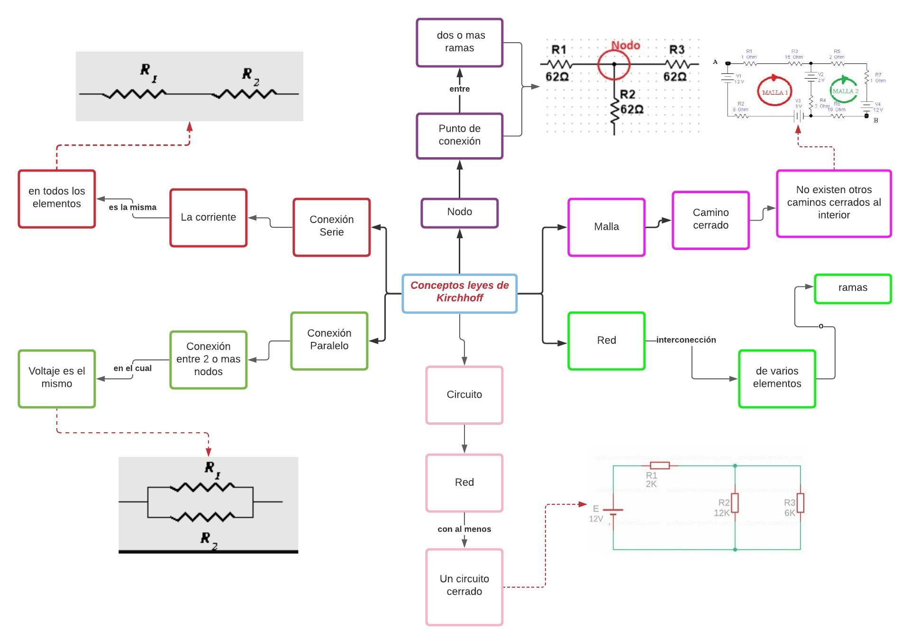
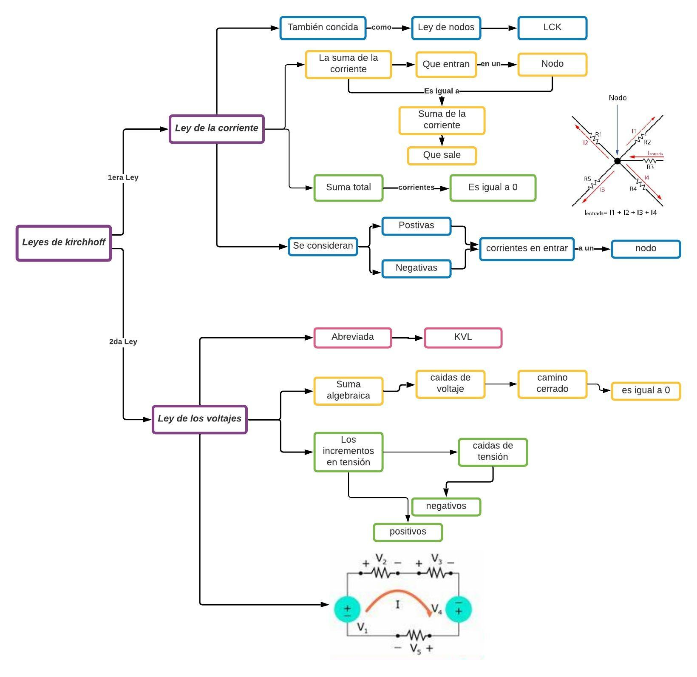
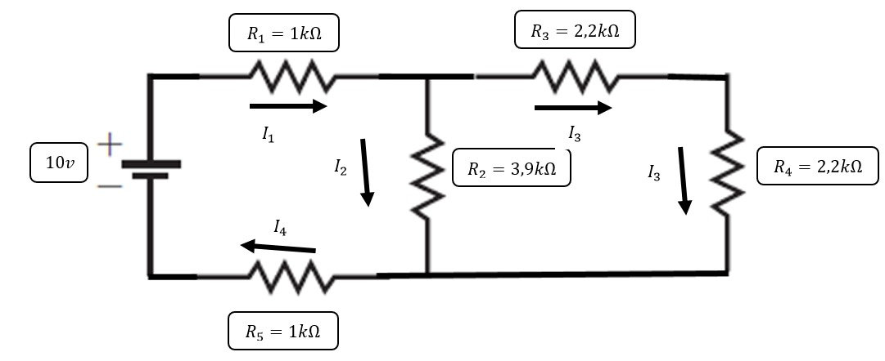
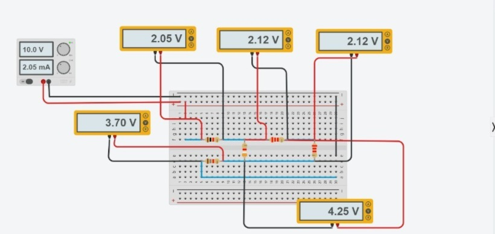
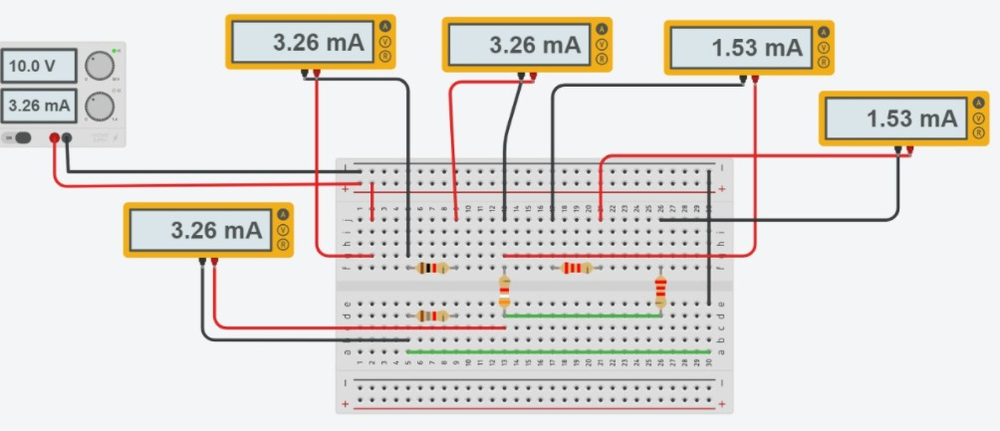
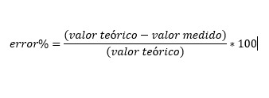
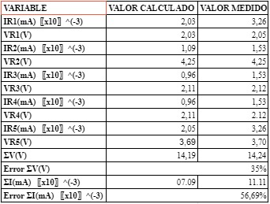
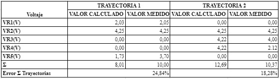
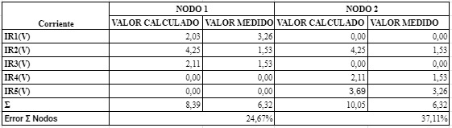

# InformeLaboratorio

1. OBJETIVO GENERAL 
 
 * Ser capaces de reconocer los tipos de circuitos eléctricos y hallar la variable faltante mediante aplicación de fórmulas.

2. OBJETIVOS ESPECIFICOS

 * Investigar el concepto de las leyes, mallas y nodos que permiten comprender y ampliar el conocimiento de corrientes y voltajes.
 * Conocer su aplicación en las leyes de Kirchhoff mediante una indagación adecuada. 
 * Relacionar las leyes de Kirchhoff con la ley de Ohnm mediante los calculos matemáticos realizados de corrientes, tensiones y resistencias demostrando asi el cumplimiento de 
 las mismas.  
 
2. MARCO TEÓRICO 

 
3. EXPLICACIÓN DEL PROCEDIMIENTO

4. RESPUESTA A INTERROGANTES Y CALCULO DEL ERROR

*Tabla 1.1. Resultados obtenidos de voltaje y corriente, en cada elemento del circuito.

*Tabla 1.2. Verificación de la LVK.

*Tabla 1.3. Verificación de la LCK.

5. VIDEO

6. CONCLUSIONES

 * Tras aprender terminología y conocimientos base de las Leyes de Kirchhoff somos capaces de aplicarlas en los circuitos en los que apliquemos.
 * Con la ayuda del análisis tenemos la habilidad de reconocer con facilidad los tipos de circuitos eléctricas y gracias a las formulas podemos resolverlos.

7. BIBLIOGRAFÍA

[1] A. Salazar, “Leyes de voltajes y corrientes de Kirchhoff.,” vol. 1, pp. 13–34, 2010.

[2] Gonzalez, A. G. (29 de Marzo de 2021). Panamahitek. Obtenido de http://panamahitek.com/ley-de-las-corrientes-de-kirchhoff-metodo-de-nodos/

[3] Ingenieria Mecafenix. (22 de Enero de 2018). Obtenido de https://www.ingmecafenix.com/electronica/ley-de-voltaje-de-kirchhoff/

 
 

